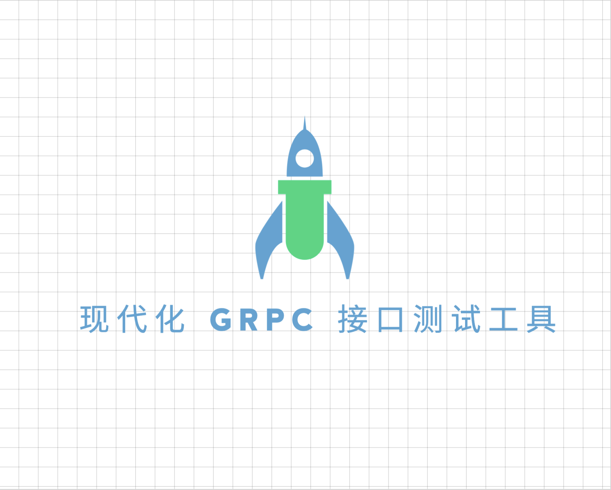

<div align="center">
<h1>RPC Master Server</h1>

[](https://github.com/vtyug/rpc-master-backend)
[](https://github.com/vtyug)
[](https://golang.org/)
[](https://www.mysql.com/)
[](https://redis.io/)
[](./LICENSE)

<p>🚀 一个现代化的 gRPC 接口测试工具 | A Modern gRPC API Testing Tool 🚀</p>

<br><br>


</div>

## 简介

RPC Master 是一个基于 Go 的 gRPC 接口测试工具，旨在提供高效的 RPC 通信能力，支持多种服务和方法的快速开发和部署。

## 功能特点

### 已实现功能

- ✅ gRPC 服务注册与发现
- ✅ 支持多种认证方式
- ✅ 自动生成 gRPC 服务代码
- ✅ 高效的请求处理与响应
- ✅ 详细的日志记录与监控

### 正在开发

- 🚧 环境配置管理
- 🚧 请求历史记录
- 🚧 性能优化与测试

### 计划开发

- 📝 支持更多的协议和格式
- 📝 集成更多的第三方服务
- 📝 提供详细的 API 文档

## 技术栈

- ⚡️ Go - 高效的编程语言
- 🛠️ Mysql - 关系型数据库
- 🛠️ Redis - 高性能的键值存储数据库
- 🛠️ Docker - 容器化部署

## 开发环境

### 系统要求

- Go 1.20+
- mysql 8.0+
- redis 7.0+

### 安装依赖

1. 克隆仓库

   ```bash
   git clone https://github.com/vtyug/rpc-master-server.git
   cd rpc-master-server
   ```

2. 安装依赖

   ```bash
   go mod tidy
   ```

3. 生成 gRPC 代码

   ```bash
   make proto
   ```

4. 启动服务

   ```bash
   go run main.go
   ```

5. 运行测试

   ```bash
   go test ./...
   ```

## 贡献指南

1. Fork 本仓库
2. 创建你的特性分支 (`git checkout -b feature/AmazingFeature`)
3. 提交你的改动 (`git commit -m 'Add some AmazingFeature'`)
4. 推送到分支 (`git push origin feature/AmazingFeature`)
5. 打开一个 Pull Request

## 许可证

[MIT License](LICENSE)